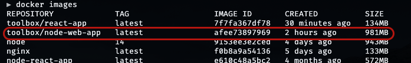
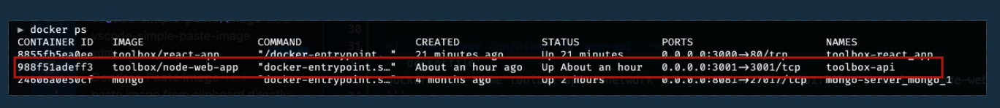
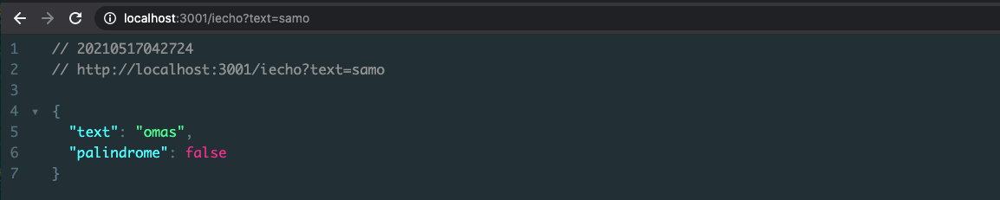
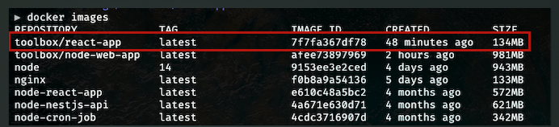
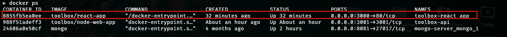
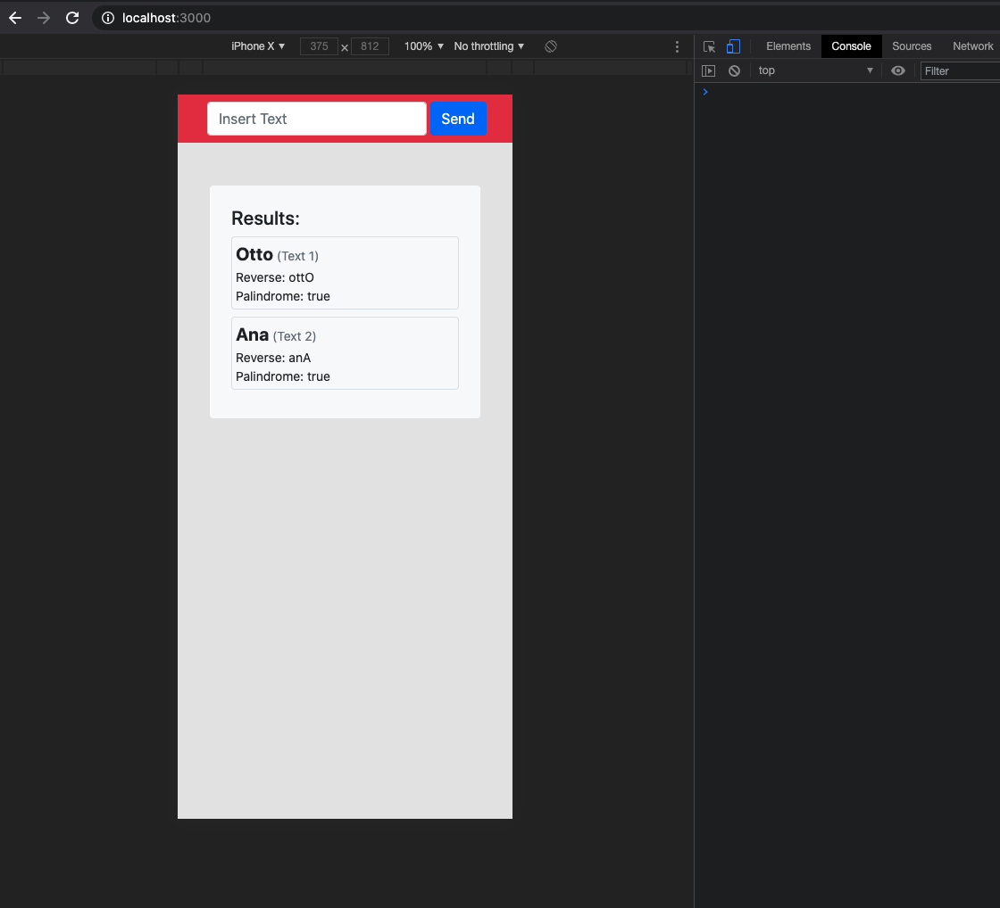

# TolboxChallenge
FULL STACK DEVELOPER (NODEJS - REACT), Code Challenge

For test this app with docker please, clone this repo and execute the next steps

## 1. Docker Network

create docker network (execute from console)
```dockerfile
docker network create --driver bridge toolbox-network
```


## 2. Backend 

access into folder backEnd from console and run this next lines

<!-- buildi image for wep-api -->
```dockerfile
docker build . -t toolbox/node-web-app
```

review the correct process

```dockerfile
docker images
```



<!-- run image container for wep-api -->
```dockerfile
docker run --name toolbox-api --network toolbox-network -p 3001:3001 -d toolbox/node-web-app 
```


review the correct process

```dockerfile
docker ps
```




test api from url browser




## 3. Frontend

access into folder backEnd from console and run this next lines

<!-- buildi image for wep-app -->
```dockerfile
docker build . -t toolbox/react-app
```



<!-- run image container for wep-app -->
```dockerfile
docker run --name toolbox-react_app --network toolbox-network -p 3000:80 -d toolbox/react-app 
```



test app from browser

